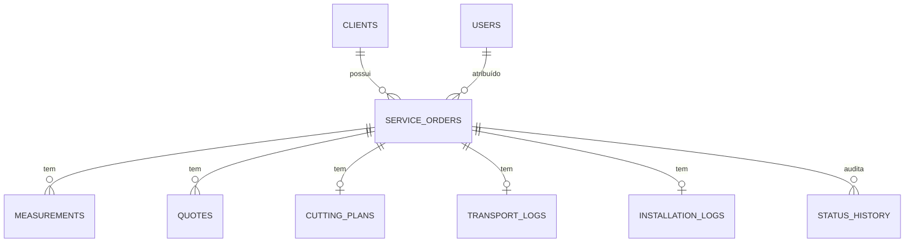
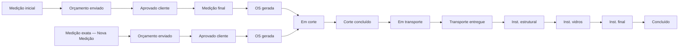
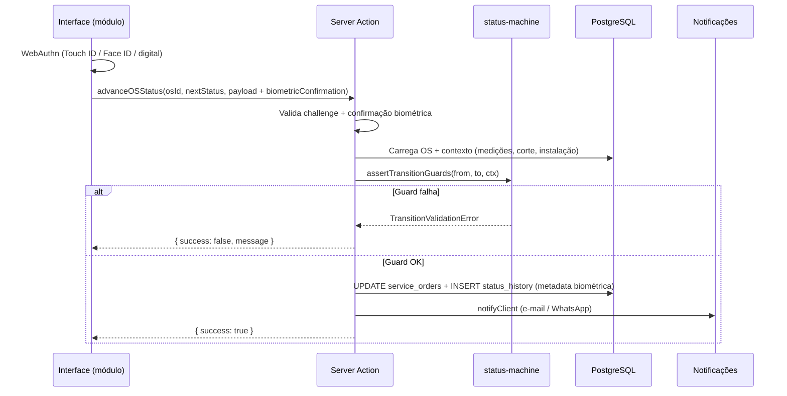
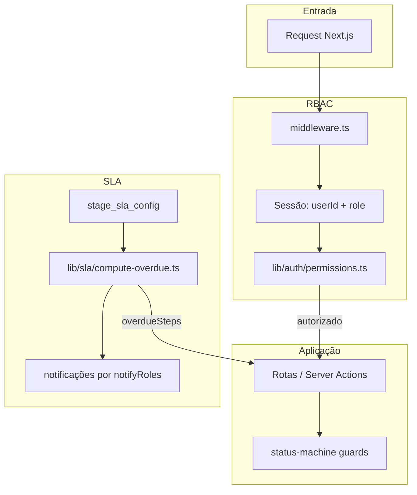
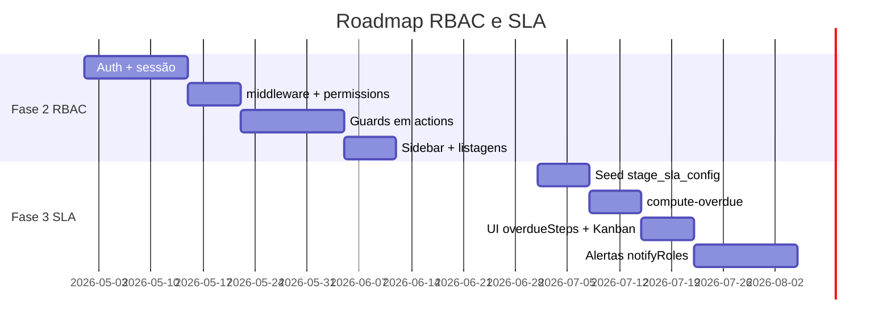

# Logística Diógenes — Plano e Documentação do Produto

> Sistema de gestão operacional para vidraçarias, com pipeline de **Ordem de Serviço (OS)** guiado por **máquina de estados**, do primeiro contato até a instalação concluída.

---

## Índice

1. [Visão Geral](#visão-geral)
2. [Modelo de Negócio](#modelo-de-negócio)
3. [Stack Tecnológica](#stack-tecnológica)
4. [Papéis e Funcionalidades](#papéis-e-funcionalidades)
5. [Fluxo Operacional Completo](#fluxo-operacional-completo)
6. [Controle de Acesso (RBAC) e SLA](#controle-de-acesso-rbac-e-sla)
7. [Plano de Implementação](#plano-de-implementação)

---

## Visão Geral

### Problema

Vidraçarias de médio porte costumam operar com planilhas, WhatsApp e anotações em papel. Isso gera:

- Perda de rastreabilidade entre medição, orçamento, corte e instalação.
- Retrabalho por medições incompletas ou desatualizadas.
- Falta de visibilidade para o gestor sobre gargalos e prazos.
- Comunicação reativa com o cliente funcionários durante as etapas.

### Solução

O **Logística Diógenes** centraliza cada **Ordem de Serviço** em um pipeline único, onde:

1. Cada etapa tem **status explícito** e regras de avanço.
2. Dados obrigatórios (medição final, embalagem, fotos, confirmação biométrica do usuário) são **bloqueios de transição**, não apenas campos opcionais.
3. O gestor acompanha tudo em **painel Kanban** com prioridade e SLA.
4. O cliente recebe **notificações** (e-mail via Resend, WhatsApp via Z-API) nos marcos relevantes.

### Objetivos do produto

| Objetivo | Indicador de sucesso |
|----------|----------------------|
| Rastreabilidade ponta a ponta | Histórico em `status_history` com `changedById` + `metadata.biometricConfirmation` |
| Redução de retrabalho | Guards impedem corte sem medição final |
| Visibilidade gerencial | Kanban + filtros por status e prioridade |
| Experiência de campo | Interface mobile-first + confirmação biométrica (WebAuthn) por etapa crítica |
| Satisfação do cliente | Aprovação digital de orçamento + comunicação proativa |

### Entidades centrais



---

## Modelo de Negócio

### Proposta de valor

O Logística Diógenes transforma a operação de uma vidraçaria de **processos informais** em um **pipeline mensurável**, reduzindo custo de retrabalho e aumentando previsibilidade de entrega.

### Segmento-alvo

- Vidraçarias com equipe de campo (medidores/instaladores).
- Operações com corte próprio ou terceirizado.
- Volume médio: dezenas a centenas de OS por mês.
- Gestores que precisam de visão consolidada sem ERP pesado.

### Fluxo de receita (vidraçaria cliente do sistema)

### Modelo de monetização do SaaS (proposta)

### Diferenciais competitivos

1. **Máquina de estados nativa** — não é CRM genérico adaptado.
2. **Guards de negócio** — regras da vidraçaria embutidas no software.
3. **Mobile-first em campo** — medição offline planejada (Fase 3).
4. **Comunicação integrada** — cliente informado nos marcos certos.
5. **Baixo atrito de adoção** — modo demo sem banco para avaliação imediata.

---

## Stack Tecnológica

### Camada de apresentação

| Tecnologia | Versão | Papel |
|------------|--------|-------|
| **Next.js** | 15.x | App Router, Server Components, Server Actions |
| **React** | 19.x | UI reativa e islands client-side |
| **TypeScript** | 5.7.x | Tipagem ponta a ponta |
| **Tailwind CSS** | 4.x | Estilização utilitária |
| **Radix UI** | — | Primitivos acessíveis (dialog, checkbox, scroll) |
| **shadcn/ui** | — | Componentes (`button`, `card`, `badge`, etc.) |
| **Lucide React** | — | Ícones |
| **@hello-pangea/dnd** | — | Drag-and-drop no Kanban |
| **skeleton** | shadecn | skeletons no carregamento dos componentes |

### Camada de dados e backend

| Tecnologia | Papel |
|------------|-------|
| **Supabase** | Banco principal |
| **Drizzle ORM** | Schema, queries tipadas, migrations |
| **Drizzle Kit** | `generate`, `migrate`, `studio` |
| **Zod** | Validação de payloads e campos JSONB |
| **postgres (driver)** | Conexão via pool |

### Integrações e infraestrutura

| Serviço | Variável de ambiente | Uso |
|---------|----------------------|-----|
| **Resend** | `RESEND_API_KEY`, `RESEND_FROM_EMAIL` | E-mails transacionais ao cliente |
| **Z-API** | `ZAPI_INSTANCE_ID`, `ZAPI_TOKEN` | Mensagens WhatsApp |
| **Upload local** | `UPLOAD_MAX_FILE_BYTES` | Fotos operacionais em `public/uploads/` (dev) |
| **Vercel Blob / Cloudinary** | (planejado Fase 2) | Upload de fotos em produção |
| **WebAuthn / Passkeys** | `WEBAUTHN_RP_ID`, `BIOMETRIC_SECRET` | Confirmação biométrica do usuário em transições críticas |

### Estrutura de pastas (resumo)

```
app/(dashboard)/     → Painel, Kanban, rotas por módulo
src/actions/         → Server Actions (OS, campo, kanban, upload)
src/lib/workflow/    → Máquina de estados + schemas Zod
src/db/              → Schema Drizzle + seed + migrations
src/components/      → UI por domínio (workflow, field, kanban)
```

### Padrões de Formulários e Máscaras

Todos os campos de entrada validados via **Zod** e controlados via **React Hook Form**.  
Componentes personalizados com **Tailwind + Shadcn/ui + Radix UI Primitives + Lucide-react**.

| Campo | Máscara |
|-------|---------|
| Telefone | `(00) 00000-0000` |
| CEP | `00000-000` | (todos oc containers com endereço que utilizem CEP devem ter busca automática para preenchimento de campo do endereço, deixando somente número, complemento, bloco, torre para preenchimento manual)
| Data | `DD/MM/AAAA` |
| CPF | `000.000.000-00` |
| CNPJ | `00.000.000/0000-00` |
| E-mail | Validação de formato |
| Senha | `type="password"` com toggle de visibilidade (ícone Eye/EyeOff) |

| Monetário | `R$ 0.000,00` | (alinhado à direita, prefixo R$, decimal automático conforme preenchimento) "auto-decimal currency input".
  **Máscara monetária com auto-decimal.**
  * Ex.: "1" -> "R$ 0,01", "12" -> "R$ 0,12", "123" -> "R$ 1,23". | 

#### TypeScript
- **Strict mode** ativado
- `noImplicitAny: true`
- `noUnusedLocals: true` / `noUnusedParameters: true`
- Interfaces para todos os DTOs da API

#### React
- Funções com hooks (sem class components)
- Estado local: `useState`, `useReducer`
- Efeitos colaterais: `useEffect` com cleanup
- Custom hooks para lógica compartilhada

#### Regras de Estilo
- **Tailwind CSS v4**: utility-first com tema customizado
- **shadcn/ui**: componentes acessíveis Radix UI
- **Design System**: variáveis CSS
- **Nunca usar `window.alert()`** — sempre usar toast via Sonner

#### Organização de Código

```typescript

// ❌ Errado — mistura lógica e UI
<button onClick={apiCall}>Salvar</button>

// ✅ Certo — separa lógica e UI
const { handleSalvar } = usePedido();
<button onClick={handleSalvar}>Salvar</button>
```

#### Convenções de Nomenclatura
- Componentes: `PascalCase`
- Funções e hooks: `camelCase`
- Um componente = uma responsabilidade

#### Configuração de Aliases (Vite)

```typescript

resolve: {
  alias: {
    "@": "/src",
  },
}

// Importar assim:
import Button from "@/components/ui/Button";
```

#### Ambientes

```
.env                  ← compartilhado (não-sensível)
.env.development      ← desenvolvimento local
.env.production       ← produção (nunca no repositório)
```

#### Qualidade de código (Biome)

- Formatação e lint unificados com **Biome** nos pacotes `client` e `server`.
- Zero erros: `npm run build` / `biome check` conforme scripts do repositório.

---

### Modos de execução

O app sempre roda com Postgres configurado via `DATABASE_URL` (Supabase pooler ou PostgreSQL local) — Drizzle + Supabase PostgreSQL. O modo demo/mock em memória foi removido.

---

## Papéis e Funcionalidades

### Papéis do sistema (`user_roles`)

| Papel | Código | Foco operacional |
|-------|--------|------------------|
| Administrador | `admin` | Configuração, usuários, visão total |
| Gerente | `gerente` | Kanban, orçamentos, revisões, KPIs |
| Medidor | `medidor` | Medição inicial e final em campo |
| Cortador | `cortador` | Plano de corte e embalagem |
| Motorista | `motorista` | Transporte e comprovante de entrega |
| Instalador | `instalador` | Instalação em 3 fases + confirmação biométrica |

### Matriz papel × módulo

| Funcionalidade | Admin | Gerente | Medidor | Cortador | Motorista | Instalador |
|----------------|:-----:|:-------:|:-------:|:--------:|:---------:|:----------:|
| Dashboard / Kanban | ✓ | ✓ | — | — | — | — |
| Criar / editar OS | ✓ | ✓ | — | — | — | — |
| Medição (`/field`) | ✓ | ✓ | ✓ | — | — | — |
| Orçamento (`/quote`) | ✓ | ✓ | — | — | — | — |
| Aprovação pública (cliente) | — | — | — | — | — | — |
| Corte (`/production`) | ✓ | ✓ | — | ✓ | — | — |
| Transporte (`/logistics`) | ✓ | ✓ | — | — | ✓ | — |
| Instalação (`/installation`) | ✓ | ✓ | — | — | — | ✓ |
| Revisão de status | ✓ | ✓ | — | — | — | — |
| Histórico / auditoria | ✓ | ✓ | — | — | — | — |

Detalhamento de permissões, matriz de rotas e integração com SLA: [Controle de Acesso (RBAC) e SLA](#controle-de-acesso-rbac-e-sla).

### Funcionalidades por módulo

#### Painel (`/dashboard`)

- Listagem de OS com badge de status e prioridade.
- Kanban drag-and-drop (`/dashboard/kanban`) com filtros.
- Detalhe da OS (`/dashboard/[osId]`) com **StatusWizard** visual.
- Indicadores de etapas em atraso (`overdueSteps`).

#### Campo (`/field`)

- Lista de OS atribuídas ao medidor.
- Botão **Nova Medição** — cria OS no fluxo `profissional_mediu` (cliente pediu visita técnica).
- Formulário de medição com dimensões, fotos e notas.
- Suporte a sync offline (Fase 3): `clientDeviceId`, `syncedAt`.

#### Orçamento (`/quote`)

- Linhas de itens (descrição, qty, preço, custo de material).
- Margem percentual e totais.
- Token público para aprovação pelo cliente.
- Estados: `rascunho` → `enviado` → `aprovado` | `rejeitado` | `expirado`.

#### Produção (`/production`)

- Plano de corte (lista de peças).
- Checklist de embalagem obrigatório antes do transporte.
- Registro de acessórios e operador.

#### Logística (`/logistics`)

- Conferência de itens (perfil, vidros, acessórios).
- Fotos de carga e entrega.
- Placa do veículo, horários de saída/chegada.

#### Instalação (`/installation`)

- Módulo com wizard mobile-first (fases, fotos antes/depois, avanço biométrico) — **implementado**.
- Fotos antes/depois (obrigatórias).
- Conclusão exige **confirmação biométrica do usuário** (instalador) — não há assinatura canvas do cliente.

#### Confirmação biométrica de usuário (transversal)

Marcos operacionais críticos exigem que o **usuário logado** confirme a ação com biometria do dispositivo (Touch ID, Face ID ou impressão digital via **WebAuthn**). Isso substitui qualquer assinatura manuscrita ou canvas do cliente.

| Etapa | Quem confirma | O que fica registrado |
|-------|---------------|----------------------|
| Medição final | Medidor | `changedById`, `metadata.biometricConfirmation` |
| Corte concluído | Cortador | idem |
| Transporte entregue | Motorista | idem |
| Instalação (estrutural / vidros / final) | Instalador | idem |
| Concluído | Instalador ou gerente | idem |

**Fluxo na UI:** preencher dados da etapa → tocar **“Confirmar com biometria”** → prompt nativo do celular → avanço liberado.

**O que não é armazenado:** imagem ou template da digital. Apenas prova criptográfica WebAuthn + timestamp + `credentialId` em `status_history.metadata`.

**Fallback (dev):** em `localhost` ou com `BIOMETRIC_ALLOW_DEV_FALLBACK=true`, confirmação simulada para testes sem sensor — bloqueada em produção.

### Componentes transversais

| Componente | Função |
|------------|--------|
| `StatusWizard` | Linha do tempo visual das 13 etapas |
| `StatusTransitionPanel` | Avanço com payload validado por Zod |
| `PhotoUpload` | Upload de imagens com limite configurável |
| `BiometricConfirmGate` | Prompt WebAuthn antes de avançar etapas críticas |
| `notifyClient` | Disparo de e-mail (Resend) e WhatsApp (Z-API) |
| `status_history` | Auditoria completa de mudanças (inclui confirmação biométrica) |

### Códigos de erro de transição

| Código | Significado |
|--------|-------------|
| `INVALID_TRANSITION` | Par de status não permitido no grafo |
| `MISSING_FINAL_MEASUREMENT` | Corte bloqueado sem medição final |
| `CUTTING_NOT_COMPLETE` | Transporte bloqueado sem corte concluído |
| `PACKAGING_INCOMPLETE` | Checklist de embalagem incompleto |
| `INSTALLATION_PHOTOS_REQUIRED` | Fotos antes/depois ausentes |
| `BIOMETRIC_CONFIRMATION_REQUIRED` | Confirmação biométrica do usuário ausente ou inválida |
| `REVISION_TARGET_INVALID` | Retorno de revisão para status incorreto |
| `REVISION_REASON_REQUIRED` | Motivo obrigatório ao entrar em revisão |

---

## Fluxo Operacional Completo

A OS percorre etapas lineares no fluxo feliz, com ramificação para **revisão** a qualquer momento (exceto após `concluido`). Antes da produção existem **dois caminhos de medição**, definidos pelo campo `measurement_flow` na OS.

### Dois caminhos de medição

- Fluxo A: Medição de orçamento (recebe medidas do cliente) → orçamento → aprovação → Medição Final (visita) → corte.

- Fluxo B: visita única → Medição Final → orçamento → aprovação → corte.

```

### Diagrama do pipeline (visão consolidada)



### Tabela de status

| # | Status (`os_status`) | Label | Módulo / Rota | Responsável típico |
|---|----------------------|-------|---------------|-------------------|
| 1 | `medicao_inicial` | Medição inicial | `/field` | Medidor |
| 2 | `medicao_final` | Medição final | `/field` | Medidor |
| 3 | `orcamento_enviado` | Orçamento enviado | `/quote` | Gerente / Admin |
| 4 | `aprovado_cliente` | Aprovado pelo cliente | `/quote` ou link público | Cliente |
| 5 | `os_gerada` | OS gerada | `/dashboard` | Gerente |
| 6 | `em_corte` | Em corte | `/production` | Cortador |
| 7 | `corte_concluido` | Corte concluído | `/production` | Cortador |
| 8 | `em_transporte` | Em transporte | `/logistics` | Motorista |
| 9 | `transporte_entregue` | Transporte entregue | `/logistics` | Motorista |
| 10 | `instalacao_estrutural` | Instalação estrutural | `/installation` | Instalador |
| 11 | `instalacao_vidros` | Instalação de vidros | `/installation` | Instalador |
| 12 | `instalacao_final` | Instalação final | `/installation` | Instalador |
| 13 | `concluido` | Concluído | `/dashboard` | Instalador / Gerente |
| — | `revisao` | Em revisão | Qualquer | Gerente / Admin |

### Detalhamento por etapa

#### 1–2. Medição (Campo)

| Ação | Fluxo | Dados capturados | Critério de avanço |
|------|-------|------------------|-------------------|
| Medição inicial | A | Dimensões aproximadas do cliente, fotos, notas | Ao menos uma dimensão |
| Medição exata (Nova Medição) | B | Dimensões no local, fotos, notas | Botão **Nova Medição** → OS `profissional_mediu` |
| Medição final pós-aprovação | A | Dimensões refinadas no local | Após `aprovado_cliente` |

**Guard crítico:** transição para `em_corte` exige `hasFinalMeasurement = true` (no fluxo B, a medição exata já conta como final).

#### 3–4. Orçamento

| Ação | Dados capturados | Critério de avanço |
|------|------------------|-------------------|
| Montagem do orçamento | Itens, quantidade, preço unitário, margem % | Subtotal e total calculados |
| Envio ao cliente | `publicToken`, `sentAt` | Status `orcamento_enviado` |
| Aprovação | Nome do aprovador, `approvedAt` | Status `aprovado_cliente` |

**Notificação:** e-mail e WhatsApp ao cliente quando orçamento é aprovado.

#### 5. OS gerada

Consolidação administrativa: OS numerada, prioridade definida (`baixa` | `normal` | `alta` | `urgente`), responsável atribuído e data prevista.

#### 6–7. Produção (Corte)

| Ação | Dados capturados | Critério de avanço |
|------|------------------|-------------------|
| Plano de corte | Lista de cortes (item, comprimento, largura, qty) | Status do plano `em_andamento` |
| Conclusão do corte | Operador, `completedAt` | `cuttingPlanStatus = concluido` |
| Embalagem | Checklist: perfil estrutural, perfis totais, acessórios, vidros | Todos os itens obrigatórios marcados |

**Guard crítico:** `em_transporte` exige corte concluído **e** checklist de embalagem completo.

#### 8–9. Logística (Transporte)

| Ação | Dados capturados | Critério de avanço |
|------|------------------|-------------------|
| Carregamento | Fotos de carga, itens conferidos | Status `carregado` / `em_transito` |
| Entrega | Fotos de entrega, comprovante, placa do veículo | Status `entregue` |

**Notificação:** WhatsApp quando material está em transporte e quando é entregue no local.

#### 10–13. Instalação

| Sub-etapa | Flag | Critério |
|-----------|------|----------|
| Estrutural | `structuralInstalled` | Perfis e estrutura fixados |
| Vidros | `glassInstalled` | Vidros instalados |
| Final | `finalCompleted` | Acabamento e vedação |

**Guards críticos:**

- `instalacao_final` e `concluido`: fotos **antes** e **depois** obrigatórias.
- Etapas críticas (incluindo `concluido`): **confirmação biométrica do usuário** via WebAuthn, registrada em `status_history.metadata.biometricConfirmation` (`credentialId`, `confirmedAt`, `authMethod`). Não há assinatura canvas do cliente.

#### Revisão (transversal)

Qualquer status (exceto `concluido`) pode ir para `revisao` com motivo registrado em `revisionReason` e status de origem em `revisionFromStatus`.

Ao sair de revisão, a OS **retorna obrigatoriamente** ao status anterior — evita saltos indevidos no pipeline.

Todas as transições são auditadas em `status_history` (de, para, motivo, usuário, metadata).

### Fluxo de dados na transição



### Prioridades da OS

| Prioridade | Uso típico |
|------------|------------|
| `baixa` | Reformas sem urgência |
| `normal` | Padrão |
| `alta` | Prazo comercial apertado |
| `urgente` | Retrabalho, VIP ou penalidade contratual |

---

## Controle de Acesso (RBAC) e SLA

Esta seção descreve o **estado atual do código**, a **arquitetura recomendada** e o **plano de implementação** para dois mecanismos **independentes** que não devem ser confundidos:

| Mecanismo | Pergunta que responde | Não é |
|-----------|----------------------|-------|
| **RBAC** (Role-Based Access Control) | *Quem pode ver, editar e avançar cada módulo/OS?* | Prazo de etapa |
| **SLA** (Service Level Agreement operacional) | *Há quanto tempo a OS está neste status? Quem deve ser alertado?* | Permissão de tela |

> **Regra de ouro:** SLA **notifica** papéis (`notifyRoles`); RBAC **autoriza** ações. Só cruzar os dois quando houver regra de negócio explícita (ex.: apenas `gerente` pode forçar saída de revisão em OS com SLA estourado).

### Estado atual no repositório

| Recurso | Schema (`schema.ts`) | Lógica / runtime |
|---------|:--------------------:|:----------------:|
| Enum `user_roles` + tabela `users` | Sim | Login demo + sessão cookie |
| Login / sessão / `middleware.ts` | — | **Parcial** — `/login`, cookie, `middleware.ts`, guards em actions |
| Sidebar filtrada por papel | — | **Sim** — `getNavItemsForRole` |
| `changedById` em transições | Sim | **Sim** — da sessão server-side |
| Tabela `stage_sla_config` | Sim | Não consultada |
| Seed de SLA | Não | — |
| Cálculo de `overdueSteps` | — | Não (prop manual no `StatusWizard`) |
| `notifyRoles` no SLA | Sim (JSONB) | Não usado |

**Conclusão:** RBAC **operacional** (login e-mail/senha, middleware, sidebar, guards). **Filtro por `assignedUserId`**, **`/unauthorized`**, wizard **`/installation`**. Pendente: OAuth, recuperação de senha, gestão de usuários.

### Arquitetura alvo



### RBAC — desenho recomendado

#### 1. Autenticação e sessão (Fase 2)

Opções alinhadas à stack atual:

| Opção | Prós | Observação |
|-------|------|------------|
| **Supabase Auth** | Já há MCP Supabase no ecossistema; RLS futuro | Mapear `auth.users.id` → `users.id` |
| **NextAuth / Auth.js** | Integração nativa Next.js | Credentials ou OAuth; sessão em JWT ou DB |

Fluxo mínimo:

1. Login em `app/(auth)/login/page.tsx` — **e-mail + senha** (hash scrypt em `users.password_hash`; demo: `demo123`).
2. Sessão com `{ userId, role, name }`.
3. `middleware.ts` na raiz: rotas públicas (`/`, `/q/*`) vs protegidas (`/(dashboard)/*`).

#### 2. Matriz de permissões (arquivo único)

Criar `src/lib/auth/permissions.ts` — fonte da verdade testável:

```typescript
// Exemplo conceitual — não existe ainda no repo
export const ROLE_ROUTE_ACCESS: Record<UserRole, string[]> = {
  admin: ["/dashboard", "/field", "/quote", "/production", "/logistics", "/installation"],
  gerente: ["/dashboard", "/field", "/quote", "/production", "/logistics", "/installation"],
  medidor: ["/field"],
  cortador: ["/production"],
  motorista: ["/logistics"],
  instalador: ["/installation"],
};
```

#### 3. Middleware por prefixo de rota

```typescript
// middleware.ts — comportamento alvo (Fase 2)
// medidor  → só /field/*
// cortador → só /production/*
// motorista → só /logistics/*
// instalador → só /installation/*
// admin | gerente → todas as rotas internas
```

Redirecionar para `/dashboard` ou `/unauthorized` quando o papel não tiver acesso ao prefixo.

#### 4. Guards em Server Actions (obrigatório)

O middleware **não substitui** validação no servidor. Em toda action sensível (`advanceOSStatus`, `transitionServiceOrderStatus`, uploads):

```typescript
// Padrão alvo em src/lib/auth/require-role.ts
export async function requireRole(allowed: UserRole[]) {
  const session = await getSession();
  if (!session || !allowed.includes(session.role)) {
    throw new ForbiddenError("FORBIDDEN");
  }
  return session; // userId confiável para changedById
}
```

| Action / operação | Papéis permitidos |
|-------------------|-------------------|
| Avançar status (campo) | `medidor`, `gerente`, `admin` |
| Avançar status (corte) | `cortador`, `gerente`, `admin` |
| Avançar status (transporte) | `motorista`, `gerente`, `admin` |
| Avançar status (instalação) | `instalador`, `gerente`, `admin` |
| Revisão (`revisao`) | `gerente`, `admin` |
| Kanban / atribuição OS | `gerente`, `admin` |
| Config SLA / usuários | `admin` |

#### 5. UI condicional

- `AppSidebar`: filtrar `NAV` com base em `ROLE_ROUTE_ACCESS`.
- Listagens por módulo: filtrar OS por `assignedUserId` ou equipe — **implementado** em `lib/auth/order-access.ts` + `listServiceOrders` / `getServiceOrderById`.
- Esconder botões de avanço quando `requireRole` falharia (melhor UX; segurança continua na action).

#### 6. Códigos de erro RBAC (propostos)

| Código | HTTP | Significado |
|--------|------|-------------|
| `UNAUTHORIZED` | 401 | Sem sessão |
| `FORBIDDEN` | 403 | Papel sem permissão para rota/ação |
| `OS_NOT_ASSIGNED` | 403 | OS de outro técnico (regra opcional por módulo) |

---

### SLA — desenho recomendado

#### 1. Modelo já existente

```390:401:src/db/schema.ts
export const stageSlaConfig = pgTable(
  "stage_sla_config",
  {
    status: osStatus("status").notNull().unique(),
    maxHours: integer("max_hours").notNull(),
    notifyRoles: jsonb("notify_roles").$type<string[]>(),
    ...
  },
);
```

| Campo | Uso |
|-------|-----|
| `status` | Etapa do pipeline com prazo |
| `maxHours` | Tempo máximo na etapa desde última entrada no status |
| `notifyRoles` | Papéis que recebem alerta (e-mail/WhatsApp interno) — **não** libera acesso |

#### 2. Referência de prazos (seed sugerido)

| Status | `maxHours` sugerido | `notifyRoles` |
|--------|---------------------|---------------|
| `medicao_inicial` | 48 | `gerente` |
| `medicao_final` | 24 | `gerente` |
| `orcamento_enviado` | 72 | `gerente` |
| `aprovado_cliente` | 168 | `gerente` |
| `em_corte` | 48 | `gerente`, `cortador` |
| `em_transporte` | 24 | `gerente`, `motorista` |
| `instalacao_estrutural` | 72 | `gerente`, `instalador` |
| `instalacao_final` | 24 | `gerente` |

Valores ajustáveis por vidraçaria via tela admin (Fase 3).

#### 3. Cálculo de atraso

Criar `src/lib/sla/compute-overdue.ts`:

1. Buscar última entrada no status atual via `status_history` (ou `service_orders.updatedAt` como fallback).
2. Carregar `maxHours` de `stage_sla_config` para `order.status`.
3. Se `horasNoStatus > maxHours` → etapa em atraso.

```typescript
// Saída alvo
type SlaResult = {
  isOverdue: boolean;
  hoursInStatus: number;
  maxHours: number;
  overdueSteps: OsStatus[]; // para StatusWizard
};
```

#### 4. Onde exibir

| Superfície | Comportamento |
|------------|---------------|
| `StatusWizard` | Prop `overdueSteps` preenchida pelo serviço SLA (não manual) |
| Kanban | Badge/ borda vermelha em cards com SLA estourado |
| Dashboard | KPI: contagem de OS em atraso por etapa |
| Notificações | Job ou hook pós-transição: se estourado, notificar `notifyRoles` |

#### 5. SLA **não** altera permissão (padrão)

Por padrão, um `medidor` continua podendo registrar medição mesmo com SLA estourado — o sistema **alerta** o `gerente`, não bloqueia o operador.

#### 6. Integração opcional RBAC × SLA

Regras extras só se o negócio exigir (documentar explicitamente):

| Regra opcional | Quem ganha permissão extra |
|----------------|----------------------------|
| Forçar avanço com SLA estourado | `gerente`, `admin` |
| Reatribuir OS atrasada | `gerente`, `admin` |
| Escalar para `revisao` automática | Sistema → notifica `gerente` |

Implementar em `assertTransitionGuards` ou camada `lib/auth/can-advance-with-sla.ts`, separada dos guards de dados (medição, embalagem, etc.).

---

### Plano de implementação (RBAC + SLA)



| # | Tarefa | Arquivos alvo | Fase |
|---|--------|---------------|------|
| 1 | Escolher e integrar Auth | `app/(auth)/`, `src/lib/auth/session.ts` | 2 |
| 2 | `middleware.ts` + `permissions.ts` | raiz, `src/lib/auth/` | 2 |
| 3 | `requireRole()` em actions | `src/actions/os-actions.ts`, `service-order.ts`, etc. | 2 |
| 4 | `changedById` da sessão (nunca do client) | `service-order.ts` | 2 |
| 5 | Filtrar sidebar e listagens | `app-sidebar.tsx`, `*-db.ts` | 2 |
| 6 | Seed `stage_sla_config` | `src/db/seed.ts` | 3 |
| 7 | `compute-overdue.ts` + testes | `src/lib/sla/` | 3 |
| 8 | Wire `overdueSteps` nas páginas | `dashboard/[osId]`, kanban | 3 |
| 9 | Job/cron de alertas SLA | API route ou Vercel Cron | 3 |

### Checklist de pronto para produção

**RBAC**

- [ ] Nenhuma rota `(dashboard)` acessível sem login
- [ ] Middleware bloqueia prefixos por papel
- [ ] Toda Server Action de escrita chama `requireRole`
- [ ] `changedById` sempre da sessão
- [ ] Testes unitários em `permissions.ts`

**SLA**

- [ ] `stage_sla_config` populado (seed ou admin)
- [ ] Atraso calculado a partir de `status_history`
- [ ] `overdueSteps` automático no `StatusWizard`
- [ ] Kanban destaca OS em atraso
- [ ] Alertas para `notifyRoles` (sem confundir com permissão)

---

## Plano de Implementação

O desenvolvimento segue fases incrementais, priorizando o fluxo crítico da OS e expandindo para módulos operacionais e inteligência de gestão.

### Fase 1 — MVP (núcleo operacional)

| Entrega | Descrição | Status |
|---------|-----------|--------|
| Máquina de estados | Grafo de transições + guards de negócio em `status-machine.ts` | Implementado |
| Dashboard + Kanban | Visão gerencial com filtros e métricas por coluna | Implementado |
| Módulo Campo | Medição inicial/final (mobile-first) | Implementado |
| Módulo Orçamento | Itens, margem, envio e aprovação | Implementado |
| Server Actions | Avanço e revisão de status com validação | Implementado |
| Modo demo | Dados mock sem `DATABASE_URL` | Implementado |
| Persistência | Supabase (PostgreSQL) + Drizzle ORM + migrations | Implementado |

### Fase 2 — Operação completa + RBAC

| Entrega | Descrição |
|---------|-----------|
| Produção (corte) | Plano de corte, checklist de embalagem, operador |
| Logística | Transporte, fotos de carga/entrega, comprovante |
| Instalação | Wizard em 3 etapas + fotos antes/depois + confirmação biométrica do usuário |
| **Confirmação biométrica** | WebAuthn / Passkeys em etapas críticas; registro em `status_history.metadata` |
| **RBAC** | Auth, sessão, `middleware.ts`, guards em Server Actions (ver [§6](#controle-de-acesso-rbac-e-sla)) |
| Link público | Aprovação de orçamento via `/q/[token]` |
| API de upload | Vercel Blob / Cloudinary para fotos operacionais |

### Fase 3 — Escala, SLA e inteligência

| Entrega | Descrição |
|---------|-----------|
| Offline-first | IndexedDB + fila de sincronização para medição em campo |
| **SLA por etapa** | Seed de `stage_sla_config`, cálculo de atraso, `overdueSteps`, alertas (ver [§6](#controle-de-acesso-rbac-e-sla)) |
| Relatórios | KPIs, produtividade por técnico, gargalos do pipeline |
| Webhooks | Integração WhatsApp (Z-API) em produção |

### Princípios arquiteturais

- **Validação pura** em `lib/workflow/` (testável, sem acesso ao banco).
- **Persistência** em Server Actions com transação e histórico em `status_history`.
- **UI por módulo** em rotas dedicadas (`/field`, `/quote`, `/production`, etc.).
- **JSON tipado** com Zod antes de gravar campos `jsonb` no PostgreSQL.

---

## Referências no repositório

| Artefato | Caminho |
|----------|---------|
| Schema do banco | `src/db/schema.ts` |
| Máquina de estados | `src/lib/workflow/status-machine.ts` |
| Fluxo linear de avanço | `src/lib/workflow/advance-flow.ts` |
| Schemas Zod (JSONB) | `src/lib/workflow/schemas.ts` |
| Confirmação biométrica | `src/lib/auth/biometric-*.ts`, `src/components/auth/biometric-confirm-gate.tsx` |
| Passkeys / sessão | `src/actions/passkey-actions.ts`, `src/actions/auth-actions.ts`, `user_passkeys` |
| Permissões RBAC | `src/lib/auth/permissions.ts`, `require-role.ts`, `middleware.ts` |
| Server Action de transição | `src/actions/service-order.ts` |
| Tabela SLA (schema) | `src/db/schema.ts` → `stage_sla_config` |
| Estrutura de pastas | `docs/ESTRUTURA_PROJETO.md` |
| README técnico | `README.md` |

---

*Documento gerado com base no estado atual do repositório Logística Diógenes. Última atualização: maio/2026.*
